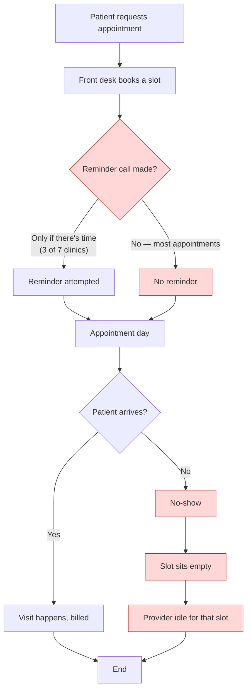
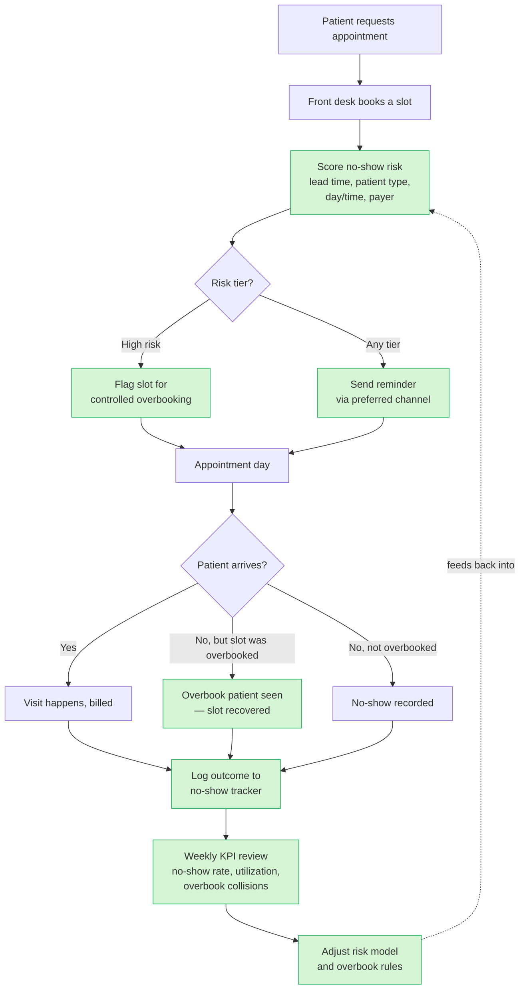

# Process Maps — Appointment Lifecycle

**Author:** Sri Vamsi Kota, Business Analyst
**Related:** `BRD.md`, `TRACEABILITY.md`, `interviews/discovery-notes.md`

This document maps the appointment lifecycle two ways: **as-is** (how it works
today, with the points where no-shows go unmanaged) and **to-be** (the redesigned
flow with the program's interventions in place).

The gap between the two diagrams is the program. Every new box in the to-be map
traces to a requirement, and every requirement traces to a stakeholder need —
see the traceability note at the end.

---

## 1. As-is — the current appointment lifecycle

What happens today. The red-flagged steps are where the process fails to manage
no-show risk — not because anyone is doing anything wrong, but because nothing in
the flow is designed to catch it.

### Where it fails today

| # | Failure point | What it costs |
|---|---|---|
| F1 | **Reminders are ad-hoc** — made "when there's time", and only 3 of 7 clinics log them at all | High-risk appointments go un-reminded; the effect is unmeasured and unmanaged |
| F2 | **Booking ignores no-show risk** — a 60-day-out new-patient Monday slot is booked exactly like a same-week established one, despite ~2.5x the no-show rate | The most predictable no-shows are the least protected against |
| F3 | **An empty slot is a dead loss** — nothing fills it, nothing overbooks against it | Provider time is unbilled; capacity is wasted |
| F4 | **No feedback loop** — no-shows are not tracked, so nothing learns | The problem is invisible to the people who could fix it |

---

## 2. To-be — the redesigned lifecycle

The same flow, with four interventions inserted. Each new (green) step maps to a
requirement in the BRD.

### What each new step does, and where it comes from

| New step | Fixes | Requirement | Need |
|---|---|---|---|
| **Score no-show risk** at booking | F2 | FR-06 (drivers ranked) | N-03 (Marcus: no-shows cluster) |
| **Controlled overbooking** for high-risk slots | F3 | FR-09 (overbook w/ downside) | N-02, N-06 (idle capacity; safety) |
| **Structured reminders** for all appointments | F1 | FR-07 (reminder effect) | N-04 (Dana: did reminders work?) |
| **No-show tracker + KPI review + feedback** | F4 | FR-10 (measurement plan) | N-07 (measurable in 2 quarters) |

---

## 3. The one step that needs the most care

**Controlled overbooking** is the intervention Dr. Raghavan will attack, and the
process map is deliberately honest about its risk. Note the branch:

> *"No, but slot was overbooked" → Overbook patient seen — slot recovered*
> *"Yes" (both the original and overbook patient arrive) → both are seen*

The second case is the danger: if you overbook a slot and **both** patients show,
someone waits. That is exactly Raghavan's objection. The to-be process manages it
two ways:

1. **Overbooking is applied only to high-risk slots** — the ones the driver
   analysis shows have ~23-26% no-show rates, not blanket-applied. You overbook
   where a no-show is likely, not everywhere.
2. **The KPI review tracks "overbook collisions"** — the rate at which both
   patients attend — as a first-class metric. If collisions climb, the overbook
   rules tighten automatically via the feedback loop.

This is why the ROI model (M8) must price the *downside* of overbooking, not just
the upside. The process map and the ROI model tell the same honest story: the
intervention works *because* it is targeted and monitored, not despite being
reckless.

---

## 4. Traceability

Every green box above traces to a requirement and a stakeholder need. Nothing in
the redesign exists because it seemed like a good idea — each step closes a
specific, documented failure in the as-is flow. That is the difference between a
process redesign and a wish list.
